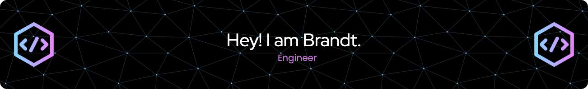

# 👋 Hi, I'm Brandt Jorgensen

I'm a software engineer with over a decade of experience building user-focused, scalable applications across FinTech, Ecommerce, and Healthcare. I specialize in **frontend development** using React, TypeScript, and modern web technologies — and I'm currently diving deeper into **backend engineering** with Python and distributed systems.

## 💻 Tech Focus
- **Frontend:** React, Angular, TypeScript, CSS, HTML
- **Backend (Learning):** Python, Java, REST APIs, Distributed Systems
- **Tools:** Node.js, Jenkins, Docker, Postman, Git
- **Practices:** Agile/Scrum, CI/CD, Cross-functional collaboration

## 🌱 Currently Learning
- Python (Boot.dev + graduate-level coursework)
- Distributed architecture & backend services
- Kotlin (planned)

## 🎸 When I'm not coding...
I'm playing rock/jazz-fusion guitar, gaming through indie story-driven titles, or digging into UX design trends.

## 📫 Connect with me
- [LinkedIn](https://www.linkedin.com/in/brandtjorgensen)
  
Thanks for stopping by!
